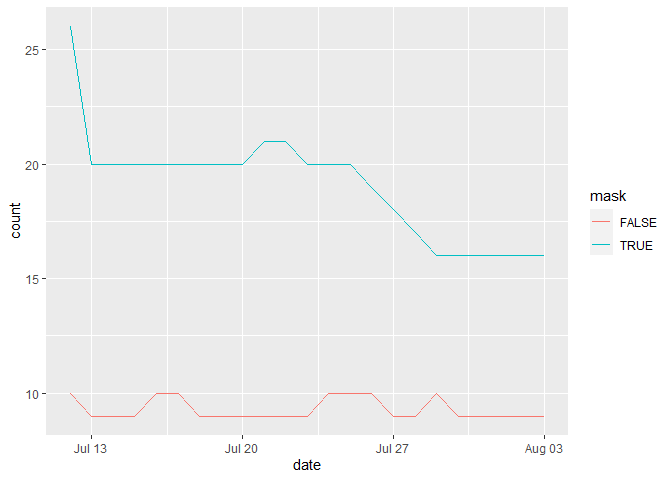

Lab 06 - Conveying the right message through visualisation
================
TEAM NAME

### Load packages and data

``` r
library(tidyverse) 
library(lubridate)
```

### Exercise 1

``` r
df <- tribble(
  ~date, ~count, ~mask,
  "12/7/2020", 10, FALSE,
  "13/7/2020", 9, FALSE,
  "14/7/2020", 9, FALSE,
  "15/7/2020", 9, FALSE,
  "16/7/2020", 10, FALSE,
  "17/7/2020", 10, FALSE,
  "18/7/2020", 9, FALSE,
  "19/7/2020", 9, FALSE,
  "20/7/2020", 9, FALSE,
  "21/7/2020", 9, FALSE,
  "22/7/2020", 9, FALSE,
  "23/7/2020", 9, FALSE,
  "24/7/2020", 10, FALSE,
  "25/7/2020", 10, FALSE,
  "26/7/2020", 10, FALSE,
  "27/7/2020", 9, FALSE,
  "28/7/2020", 9, FALSE,
  "29/7/2020", 10, FALSE,
  "30/7/2020", 9, FALSE,
  "31/7/2020", 9, FALSE,
  "1/8/2020", 9, FALSE,
  "2/8/2020", 9, FALSE,
  "3/8/2020", 9, FALSE,
  "12/7/2020", 26, TRUE,
  "13/7/2020", 20, TRUE,
  "14/7/2020", 20, TRUE,
  "15/7/2020", 20, TRUE,
  "16/7/2020", 20, TRUE,
  "17/7/2020", 20, TRUE,
  "18/7/2020", 20, TRUE,
  "19/7/2020", 20, TRUE,
  "20/7/2020", 20, TRUE,
  "21/7/2020", 21, TRUE,
  "22/7/2020", 21, TRUE,
  "23/7/2020", 20, TRUE,
  "24/7/2020", 20, TRUE,
  "25/7/2020", 20, TRUE,
  "26/7/2020", 19, TRUE,
  "27/7/2020", 18, TRUE,
  "28/7/2020", 17, TRUE,
  "29/7/2020", 16, TRUE,
  "30/7/2020", 16, TRUE,
  "31/7/2020", 16, TRUE,
  "1/8/2020", 16, TRUE,
  "2/8/2020", 16, TRUE,
  "3/8/2020", 16, TRUE
)
```

### Exercise 2

``` r
df %>%
  mutate(date = dmy(date)) %>%

  ggplot(mapping = aes(x = date,
                       y = count,
                       color = mask)) +
  geom_line()
```

<!-- -->

### Exercise 3

*Our visualization is more appropriate because the scale is the same for
everything. The data is more comparable.*

### Exercise 4

*Surprisingly, counties that are not wearing mask has shown less case of
COVID-19, per 100k population!*
